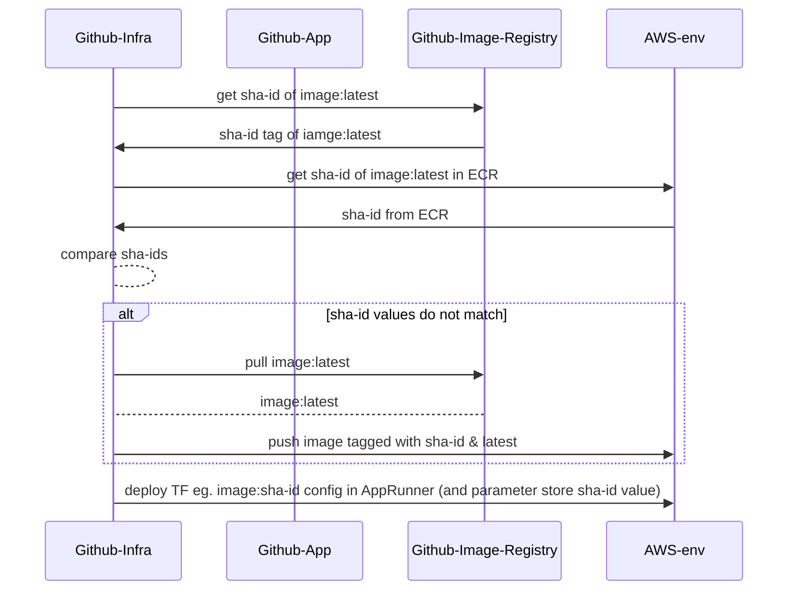

# ADR005: Use separate internal github repo to deploy infrastructure

Date: 2024-01-30

## Status

  * Accepted
  
## Context

  * Request account tool is a ruby app within a public github repo (following a previously agreed principle of coding in the open)
  * Replatforming the app requires new infrastructure for AppRunner, secrets, developer access to AWS acc, etc which[ will be managed in terraform](./ADR002-terraform-managed-infrastructure.md) 

## Decision

  * Use a separte internal github repo with no public access to:
	- configure and run all terraform (via OIDC github provider/role in AWS accs)
    - contain all secrets required by application on both test and prod   

## Considered Options

  * Separate github repo with no public access (internal only): DECISION will allow other users in the github org access to the repo to help support/understand the infra/deployments if needed
  * Separate private github repo: only team would be able to see repo, might be too restrictive since Engineering Enablement is small team and may required support at times from other SRE/Devs in GDS.
  * Keep it all in same public repo:  In theory this _should_ be just as secure as keeping the code of the app in the public repo, if the infra/deployment is configured correctly. However, there is no need to make it public and it could expost potential attack vectors that a) develop vulnerabilites and aren't patched quickly enough, b) are exposed through user/developer error/misconfiguration
  * Make app repo internal: goes against the original principle of app developers making it public (should we retract and make it internal?)

## Consequences
  
  * Once app git repo main branch is updated it may be desirable to run the deployment (although not always the case)
    - there needs to be a way to trigger the deployment of the infrastructure (suggest manual for now)
  * Need to ensure that the latest image from the app github registry is the one that is deployed to ECR/apprunner
  * The image only needs copied if the latest image in github registry is different to the latest image in AWS env ECR

## Other Notes ##

### Sequence diagram for build/deploy of image ###

